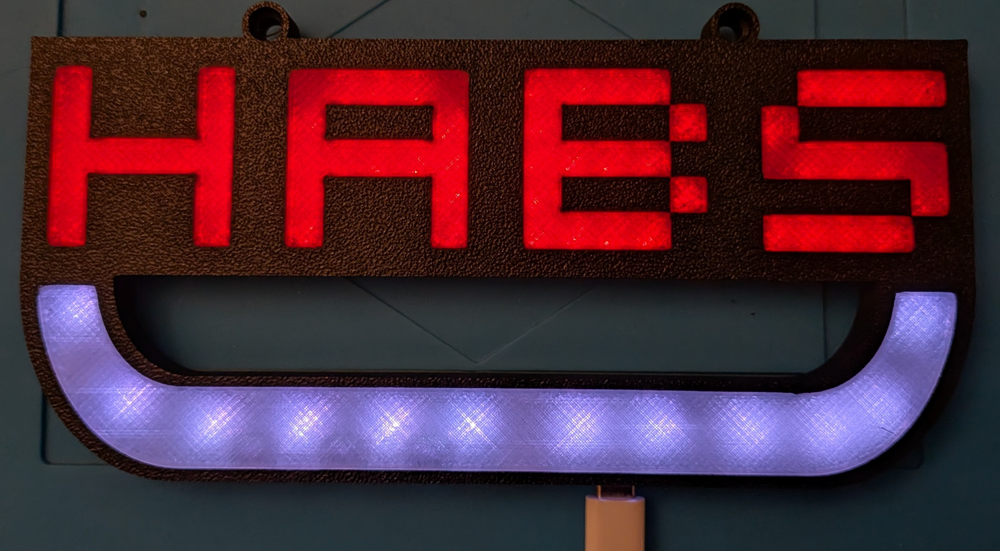
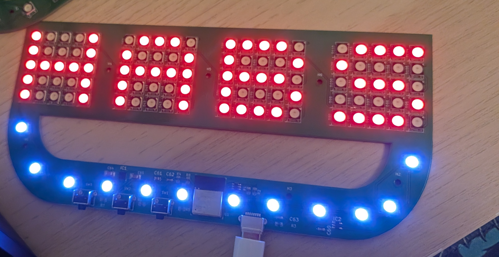
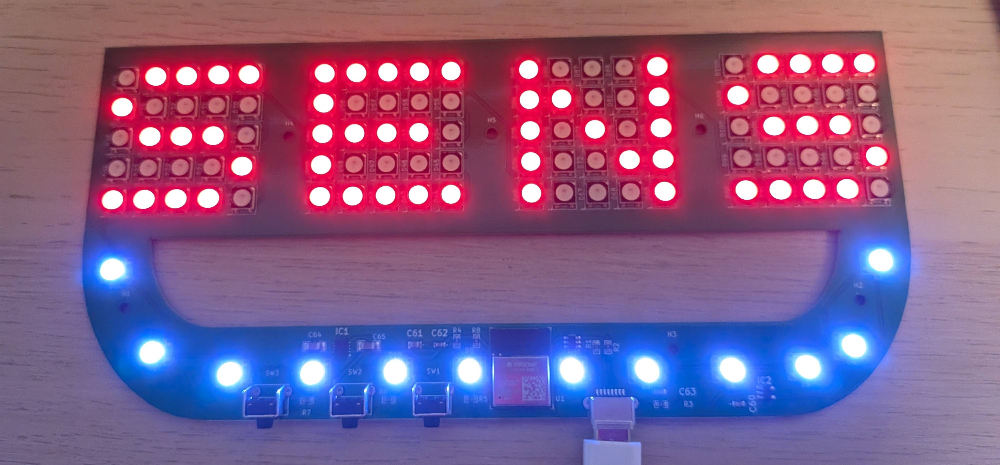
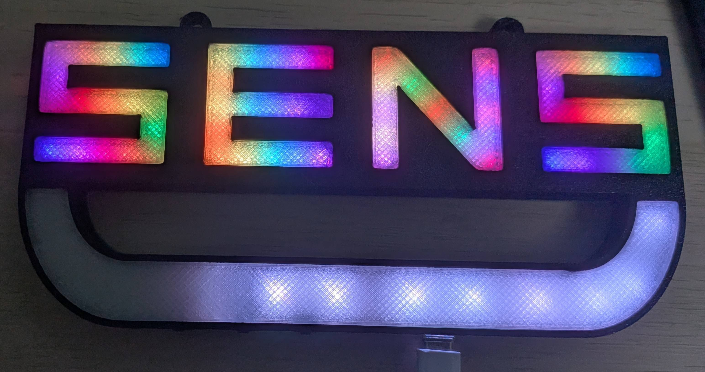

# LumaRink 5x5 LED Matrices Board Firmware



This repository contains the firmware and full documentation for the **LumaRink 5x5 LED boards**, including both barebones PCBs and fully assembled kits.

---

## Overview

- Displays names, hockey team logos, and patterns on a 5x5 LED matrix.
- Connects to WiFi for live NHL score updates using a **unique goal routine**.
- Supports multiple colour modes, routines, and brightness control.
- Open source firmware, fully documented for recovery or customization.
- Fully compatible with the **FastAPI server** for live team scores.

**Video Demo:**  
[Watch a full demo of the board features on YouTube](https://www.youtube.com/watch?v=oLjh33H-Hdk)

### Board Progression Examples






---

## Powering On & WiFi Connection

- When powered, most of the skate will light up, indicating the board is attempting to connect to WiFi.  
- This may take a few seconds.  
- If the connection is successful, the LEDs will flash **three times**, enabling NHL updates.  

> **Power Note:** If you plan to run the LEDs at **maximum brightness**, make sure to use a **3A USB power supply**. Lower-rated supplies may cause flickering, resets, or damage to the board.

### Setting Up WiFi

1. If the device is **not already connected** to WiFi, it will broadcast an access point named:  
   - SSID: `LumaRink`  
   - Password: `LumaRink`
2. Connect to this access point using a phone, tablet, or computer.  
3. Open a web browser and navigate to:  
   - http://192.168.4.1
4. Follow the on-screen instructions to enter your local WiFi network’s **SSID and password**.  
5. The board will attempt to connect to your local network automatically.  
6. **If the device does not appear as an access point**, hold down the **Brightness / WiFi Reset button** for 5+ seconds to force AP mode.

---

## Button Functions

The back of the PCB is silk-screened to indicate each button’s function.

### Brightness Control
- Single press the **Brightness Button** to lower brightness by half.  
- Once it reaches minimum, it resets to maximum.

### WiFi Reset
- Hold the **Brightness / WiFi Reset Button** for 5+ seconds to clear WiFi settings and force AP mode.  
- Follow the WiFi setup steps above to reconnect.

### Colour Modes
- Single press the **Colours Button** to cycle modes:  
  - Team colours  
  - LGBTQ2+  
  - Trans  
  - Custom (if requested/configured)

### Colour Routines
- Pressing the **Colour Button** repeatedly cycles through routines:  
1. **Flashing** – Flashes on/off, cycling through the selected colour mode.  
2. **Fill** – Fills from button to top, then empties downward.  
3. **Skate** – Fills left-to-right and empties right-to-left; cycles colours per pass. The button ‘skate’ fills/empties white on its own.  
4. **RNG Skate** – Similar to Skate, but each LED cycles colours independently.  
5. **Fade** – Fades from maximum brightness to off and back, cycling colours.

---

## NHL Updates

- When connected to WiFi, the board fetches live NHL data from the **FastAPI server**.  
- Sends JSON payload with the team name and firmware version:

```json
{
  "message": "<team_name>",
  "version": <myVersion>
}
```

- Server returns JSON with current game state, score, and server URL:

```json
{
  "team_name": "<team_name>",
  "score_game": <score>,
  "game_state": "<PRE|LIVE|CRIT|FUT|OFF>",
  "firmware_server_url": "<current_server_url>",
  "latestVersion": <latest_version>
}
```

**Polling intervals:**

- **Board → Server:** Every 10 seconds while the game is active (`PRE`, `LIVE`, `CRIT`).  
- **Server → NHL API:** Every 5 seconds, independently of any board requests.  
  - This ensures the server always has up-to-date scores ready for any connected boards, accounting for the NHL API's own refresh timing.  

**Notes:**

- `myVersion` is used **only to detect server URL changes**.  
- Teams not playing today may return `"error": "Team not found"`.  
- For full details, refer to [Server.md](docs/Server.md).
